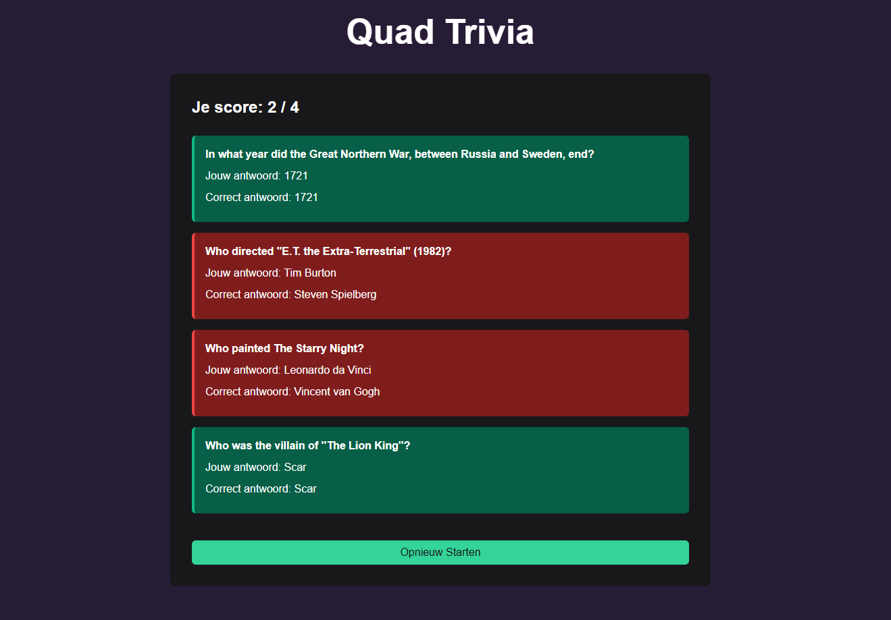

# Quad Trivia assignment
A simple full-stack web application that lets users test their knowledge with questions from the [Open Trivia Database](https://opentdb.com/).  
The application is built with **Vue.js + Vite** for the frontend and **Java 21 + Spring Boot** for the backend.

# Screenshot
Start page

 

Questions page 


Results page 



# Technology Stack

## Backend
- Java 21+
- Spring Boot 3.x
- Maven for dependency management
- RESTful API architecture
- In-memory data storage

## Frontend
- Vue.js 3
- vite 7.1.7
- Primevue 4.3.9 for UI components
- NPM for package management

# Features

- **Dynamic Question Fetching**: Questions are retrieved from the Open Trivia Database API
- **Multiple Categories**: Support for various trivia categories
- **Difficulty Levels**: Easy, medium, and hard difficulty options
- **Session Management**: Token-based session handling to prevent question repetition
- **Answer Validation**: Answer checking with detailed results
- **Score Tracking**: Keep track of correct answers and score

# Getting Started

## Requirements
- Java 21+
- Maven 3.8+
- Node.js 18+ and npm 9+

Clone the repository:
```bash
git clone https://github.com/zeinsansi/trivia_assessment.git
cd trivia_assessment
```

Navigate to the backend folder:
```bash
cd trivia-backend
 ```

Build and run the backend:
```bash
mvn spring-boot:run
```

Open your browser at: `http://localhost:8080`

## Testing
To run the tests, use the following command in the backend folder:

```bash
./mvnw test
```
